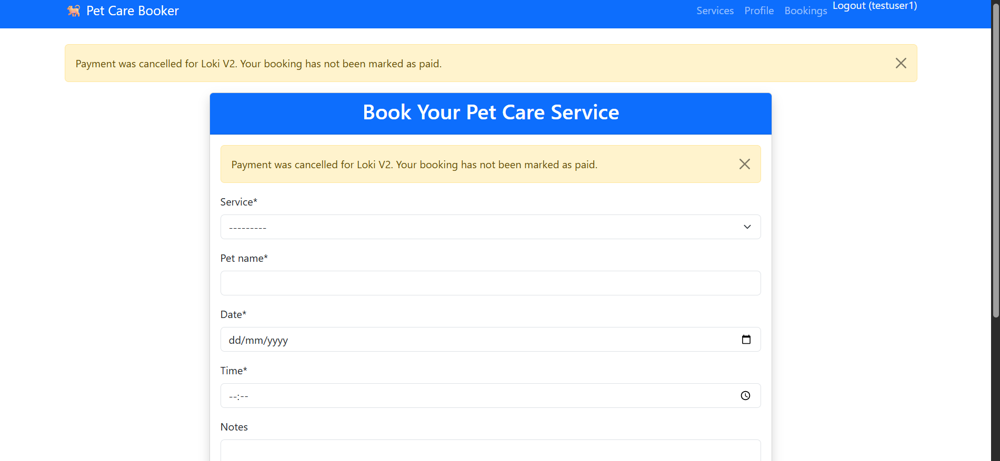
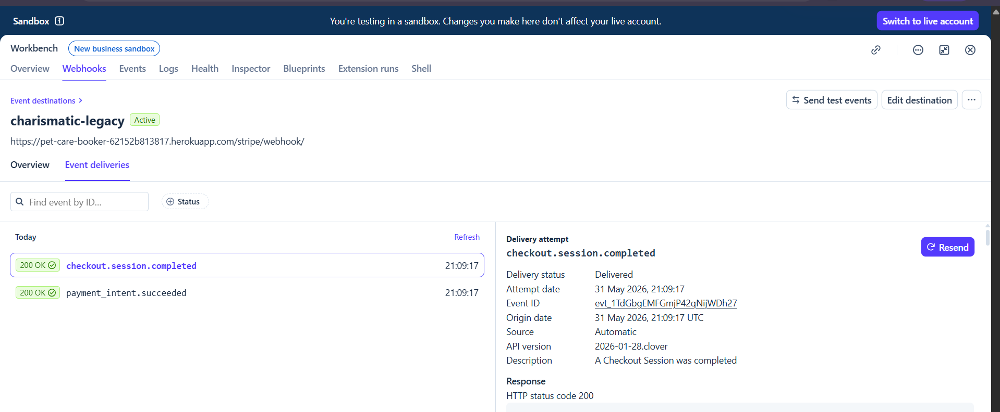

# 🐕 Pet Care Booker

A full-stack Django web application for booking trusted pet care services in Leicester. Users can register, browse available services, create and manage bookings, and pay securely through Stripe Checkout, with booking payment status updated only after Stripe webhook confirmation.

## Table of Contents

- [Overview](#overview)
- [Features](#features)
- [User Journey](#user-journey)
- [Payment Flow](#payment-flow)
- [Screenshots](#screenshots)
- [Project Structure](#project-structure)
- [Tech Stack](#tech-stack)
- [Environment Variables](#environment-variables)
- [Deployment](#deployment)
- [Local Setup](#local-setup)
- [Testing](#testing)
- [Known Limitations](#known-limitations)
- [Acknowledgements](#acknowledgements)
- [Attributions](#attributions)

## Overview

Pet Care Booker is a responsive Django application designed to help pet owners book trusted local pet care services such as dog walking, grooming, and boarding. Users can create accounts, log in, make bookings, manage existing bookings, and complete secure payments through Stripe Checkout in a deployed Heroku environment.

**Live Demo**: [Pet Care Booker](https://pet-care-booker-62152b813817.herokuapp.com/)

## Features

- User authentication with sign up, log in, and log out.
- Service browsing for dog walking, grooming, and boarding.
- Booking creation with service, pet name, date, time, and notes.
- Booking management with create, read, update, and delete functionality.
- Stripe Checkout integration for secure online payments.
- Stripe webhook confirmation to update booking payment status only after verified payment success.
- Unpaid booking recovery flow, allowing users to return to saved bookings and complete payment later.
- Responsive Bootstrap layout for desktop and mobile devices.
- Django admin panel for site administration and data management.

## User Journey

1. A guest user can visit the home page, browse services, and register for an account.
2. A logged-in user can create a booking and save it.
3. If the user does not pay immediately, the booking remains saved as unpaid and can be reopened later from **My Bookings**.
4. The user can return to the booking page, see the saved form pre-filled, and continue to Stripe Checkout.
5. After payment, Stripe redirects the user back to the app and the deployed webhook endpoint confirms the completed checkout session.
6. Once the webhook is delivered successfully, the booking is updated to show a paid status in the bookings view.

## Payment Flow

The payment journey uses Stripe Checkout together with a deployed webhook endpoint to ensure booking records are updated only after Stripe confirms a successful transaction.

**Webhook endpoint:**

```text
https://pet-care-booker-62152b813817.herokuapp.com/stripe/webhook/
```

The booking and payment flow was improved so that users can:

- create a booking first,
- return to it later if unpaid,
- reopen it from the bookings page,
- complete payment without re-entering form details.

This prevents unfinished bookings from being lost and improves the checkout experience.

## Screenshots

### Guest Experience
[](https://pet-care-booker-62152b813817.herokuapp.com/)
[](https://pet-care-booker-62152b813817.herokuapp.com/signup/)

### Authenticated Experience
[](https://pet-care-booker-62152b813817.herokuapp.com/)
[](https://pet-care-booker-62152b813817.herokuapp.com/services/)

### Booking Flow
[](https://pet-care-booker-62152b813817.herokuapp.com/book/)
[](https://pet-care-booker-62152b813817.herokuapp.com/book/)
[](https://pet-care-booker-62152b813817.herokuapp.com/book/)
[](https://pet-care-booker-62152b813817.herokuapp.com/book/)
[](https://pet-care-booker-62152b813817.herokuapp.com/bookings/)

### Booking Management
[](https://pet-care-booker-62152b813817.herokuapp.com/bookings/)
[](https://pet-care-booker-62152b813817.herokuapp.com/bookings/)
[](https://pet-care-booker-62152b813817.herokuapp.com/bookings/)
[](https://pet-care-booker-62152b813817.herokuapp.com/profile/)

### Mobile Views
[](https://pet-care-booker-62152b813817.herokuapp.com/)
[](https://pet-care-booker-62152b813817.herokuapp.com/services/)

### Stripe Webhook Verification
[](https://pet-care-booker-62152b813817.herokuapp.com/bookings/)

## Project Structure

```text
pet-care-booker/
├── accounts/              # Authentication, profile, base templates, and shared user logic
│   ├── migrations/
│   ├── templates/
│   ├── forms.py
│   ├── models.py
│   ├── urls.py
│   └── views.py
├── bookings/              # Booking creation, update, delete, list views, and booking templates
│   ├── migrations/
│   ├── templates/
│   ├── forms.py
│   ├── urls.py
│   └── views.py
├── payments/              # Stripe Checkout session creation and webhook handling
│   ├── migrations/
│   ├── urls.py
│   └── views.py
├── petcarebooker/         # Project settings and root URL configuration
├── screenshots/           # README screenshots and evidence images
├── static/                # Static files
├── manage.py
├── Procfile
├── requirements.txt
└── README.md
```

## Tech Stack

| Area | Technologies |
|------|--------------|
| Frontend | HTML5, Bootstrap 5, Crispy Forms, JavaScript |
| Backend | Django 5, Python, Gunicorn |
| Database | SQLite in development, PostgreSQL in production |
| Deployment | Heroku, Whitenoise |
| Payments | Stripe Checkout, Stripe Webhooks |

## Environment Variables

Create a `.env` file locally and set matching config vars in Heroku:

```text
DEBUG=False
SECRET_KEY=your-secret-key
DATABASE_URL=your-database-url
STRIPE_PUBLISHABLE_KEY=pk_test_...
STRIPE_SECRET_KEY=sk_test_...
STRIPE_WEBHOOK_SECRET=whsec_...
```

## Deployment

### Heroku deployment steps

1. Create the Heroku app.
2. Add the Heroku Postgres add-on.
3. Set all required config vars, including Stripe publishable, secret, and webhook secret keys.
4. Push the project to Heroku.
5. Run migrations on the production database.
6. Confirm static files load correctly and the deployed app opens successfully.
7. Register the Stripe webhook endpoint in the Stripe Dashboard using the deployed Heroku URL.
8. Confirm successful event delivery and verify that paid bookings update correctly.

### Stripe webhook setup

The deployed webhook URL used for production testing is:

```text
https://pet-care-booker-62152b813817.herokuapp.com/stripe/webhook/
```

After creating the webhook endpoint in Stripe Dashboard, the signing secret must be added to Heroku as `STRIPE_WEBHOOK_SECRET`.

## Local Setup

```bash
git clone <repo-url>
cd pet-care-booker
python -m venv venv

# Windows
venv\Scripts\activate

# macOS/Linux
source venv/bin/activate

pip install -r requirements.txt
python manage.py makemigrations
python manage.py migrate
python manage.py createsuperuser
python manage.py runserver
```

## Testing

### Manual testing completed

| Feature | Test performed | Outcome |
|--------|----------------|---------|
| Public pages | Opened home page and services page on deployed app | Passed |
| Authentication | Logged in and accessed protected pages | Passed |
| Booking creation | Submitted booking form and confirmed booking record creation | Passed |
| Booking update | Edited an existing booking from the bookings page | Passed |
| Booking deletion | Deleted an existing booking through confirmation flow | Passed |
| Saved unpaid booking flow | Reopened unpaid booking from **My Bookings** and confirmed the form stayed pre-filled | Passed |
| Stripe Checkout | Created checkout session and completed payment through Stripe | Passed |
| Webhook delivery | Stripe delivered checkout confirmation events to deployed Heroku webhook endpoint | Passed |
| Paid booking update | Booking status updated to **Paid** after webhook confirmation | Passed |
| Responsive layout | Verified mobile layouts through screenshots and responsive checks | Passed |

### Automated testing

Run the test suite with:

```bash
python manage.py test
```

### Cross-browser and device testing

- Chrome
- Firefox
- Edge
- Safari
- Chrome DevTools mobile emulation

## Known Limitations

- The project would benefit from a broader automated test suite for authentication, booking ownership, and payment state handling.
- Services are currently presented as fixed options rather than database-managed service records.
- Stripe integration currently focuses on the checkout and webhook confirmation path rather than a wider payment dashboard or refund workflow.

## Acknowledgements

- My family, for their support and patience throughout the development process.
- Code Institute mentors and learning resources, for guidance during the project.
- The CI learner community, for discussion and shared troubleshooting.

## Attributions

- [Bootstrap 5](https://getbootstrap.com)
- [Stripe Documentation](https://stripe.com/docs/payments/checkout)
- [Heroku Dev Center](https://devcenter.heroku.com)
- [Django Documentation](https://docs.djangoproject.com)
- [Django Crispy Forms](https://django-crispy-forms.readthedocs.io)
- Perplexity AI, for debugging support during Heroku deployment, Stripe integration, and production configuration.