# 🐕 Pet Care Booker

A full-stack Django application for booking trusted pet care services in Leicester. The project allows users to register, browse services, create and manage bookings, and pay securely through Stripe Checkout with booking payment status updated after verified webhook confirmation from Stripe. [file:1059][file:1060]

## Table of Contents

- [Overview](#overview)
- [Features](#features)
- [User Journey](#user-journey)
- [Payment Flow](#payment-flow)
- [Screenshots](#screenshots)
- [Folder Structure](#folder-structure)
- [Tech Stack](#tech-stack)
- [Environment Variables](#environment-variables)
- [Deployment](#deployment)
- [Testing](#testing)
- [Known Limitations](#known-limitations)
- [Acknowledgements](#acknowledgements)
- [Attributions](#attributions)

## Overview

Pet Care Booker is a responsive web application designed to help pet owners in Leicester book trusted local pet care services such as dog walking, grooming, and boarding. Users can create accounts, log in, manage their own bookings, and complete payments using Stripe Checkout in a deployed Heroku environment. [file:1071][file:1059]

**Live Demo**: [https://pet-care-booker-62152b813817.herokuapp.com/](https://pet-care-booker-62152b813817.herokuapp.com/) [file:1071]

## Features

- User authentication with sign up, log in, and log out. [file:1071]
- Service browsing for dog walking, grooming, and boarding. [file:1071]
- Booking creation with date, time, pet name, and notes. [file:1071]
- Booking management with create, read, update, and delete functionality. [file:1071]
- Stripe Checkout payment integration for secure online payments. [file:1071]
- Stripe webhook confirmation to update booking payment status only after successful payment confirmation from Stripe. [file:1059][file:1060]
- Responsive Bootstrap layout for desktop and mobile devices. [file:1071]
- Django admin panel for site administration and data management. [file:1071]

## User Journey

1. A guest user can visit the home page, browse services, and register for an account. [file:1071]
2. A logged-in user can create a booking, review it, and continue to Stripe Checkout for payment. [file:1071][file:973]
3. After payment, Stripe redirects the user back to the app and the deployed webhook endpoint confirms the completed checkout session. [file:973][file:1059]
4. Once the webhook is delivered successfully, the booking is updated to show a paid status in the bookings view. [file:1059][file:1060]

## Payment Flow

The payment journey uses Stripe Checkout together with a deployed webhook endpoint to ensure booking records are updated only after Stripe confirms a successful transaction. The deployed webhook endpoint is:

```text
https://pet-care-booker-62152b813817.herokuapp.com/stripe/webhook/
```

Recent production testing showed the Heroku webhook endpoint responding with HTTP 200 for `checkout.session.completed` and `payment_intent.succeeded`, and the relevant booking was updated to **Paid** in the user interface. [file:1059][file:1060]

## Screenshots

### Guest Experience
[](https://pet-care-booker-62152b813817.herokuapp.com/)
[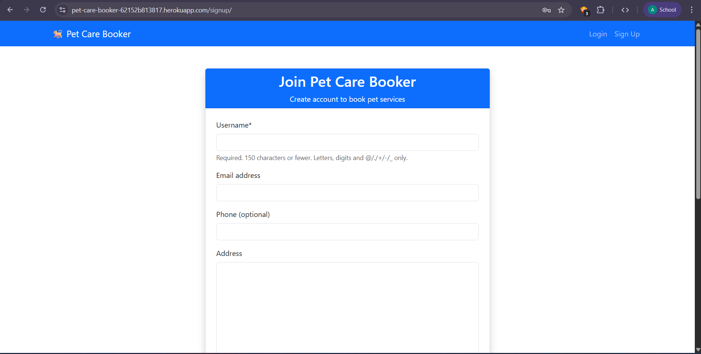](https://pet-care-booker-62152b813817.herokuapp.com/signup/)

### Authenticated Experience
[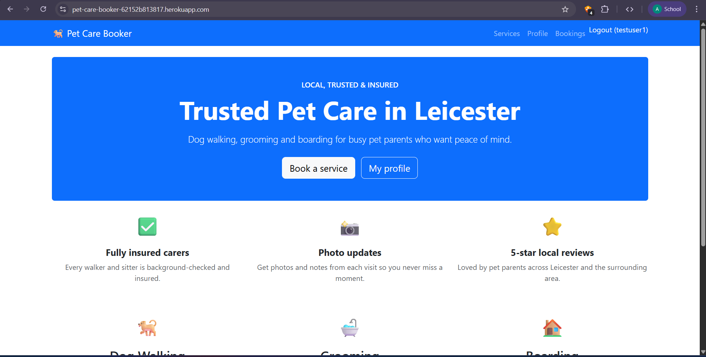](https://pet-care-booker-62152b813817.herokuapp.com/)
[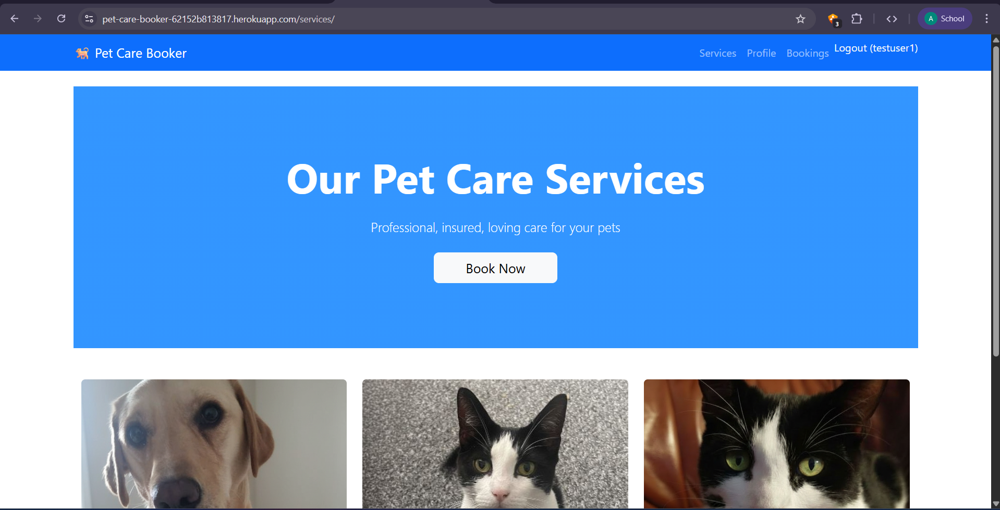](https://pet-care-booker-62152b813817.herokuapp.com/services/)

### Booking Flow
[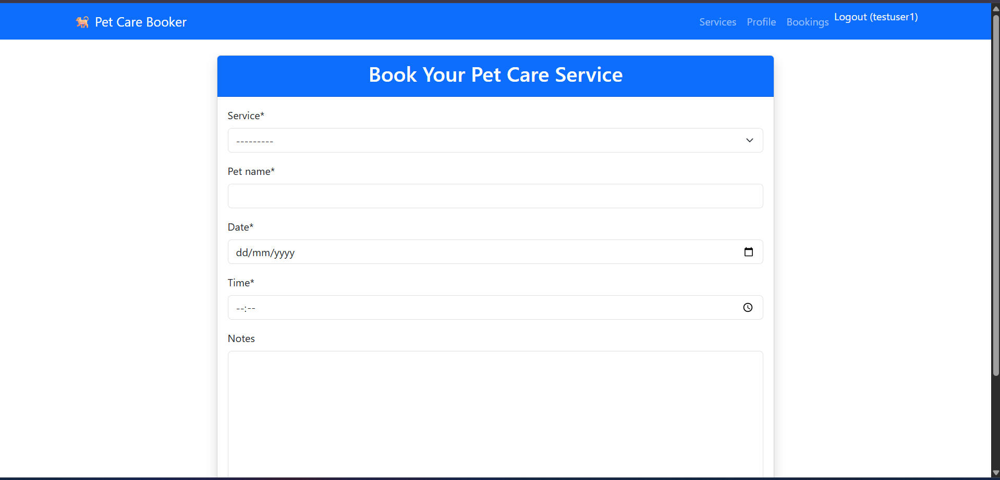](https://pet-care-booker-62152b813817.herokuapp.com/book/)
[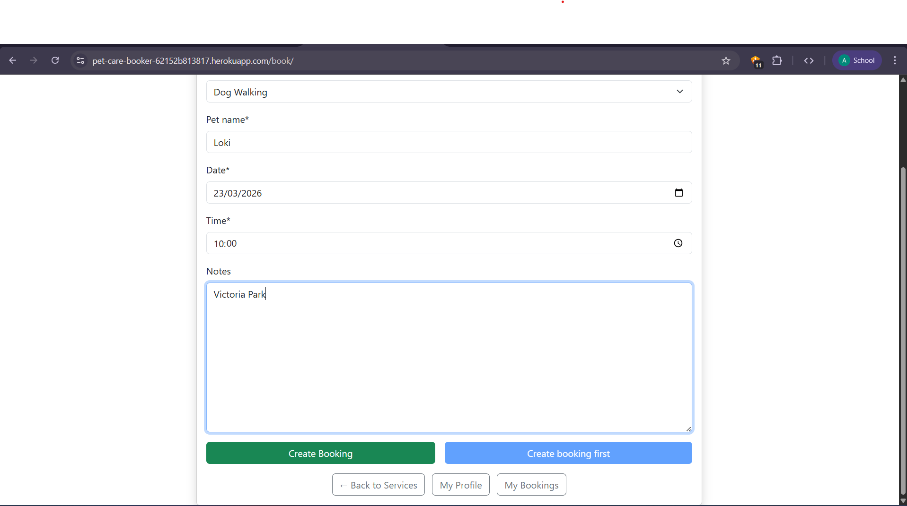](https://pet-care-booker-62152b813817.herokuapp.com/book/)
[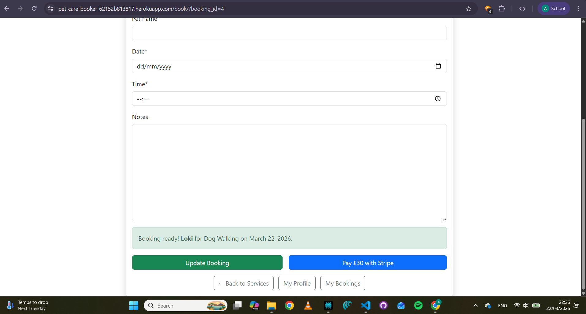](https://pet-care-booker-62152b813817.herokuapp.com/book/)
[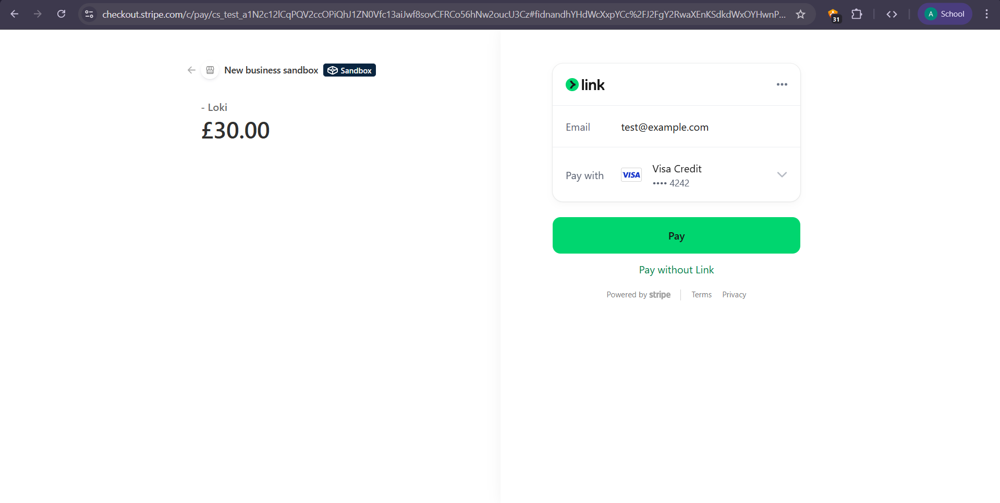](https://pet-care-booker-62152b813817.herokuapp.com/book/)

### Dashboard & Management
[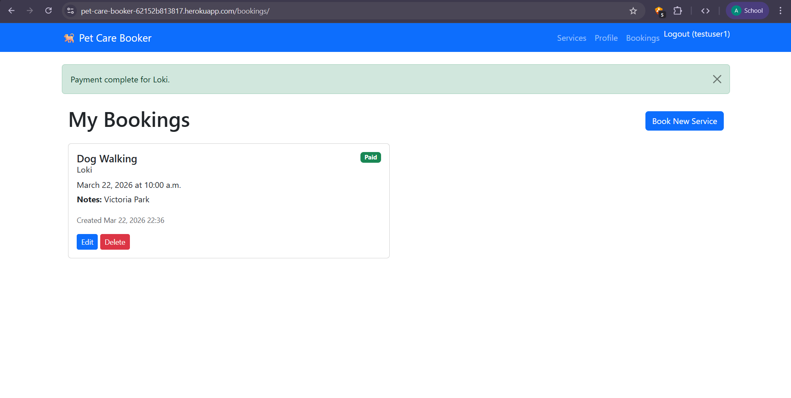](https://pet-care-booker-62152b813817.herokuapp.com/bookings/)
[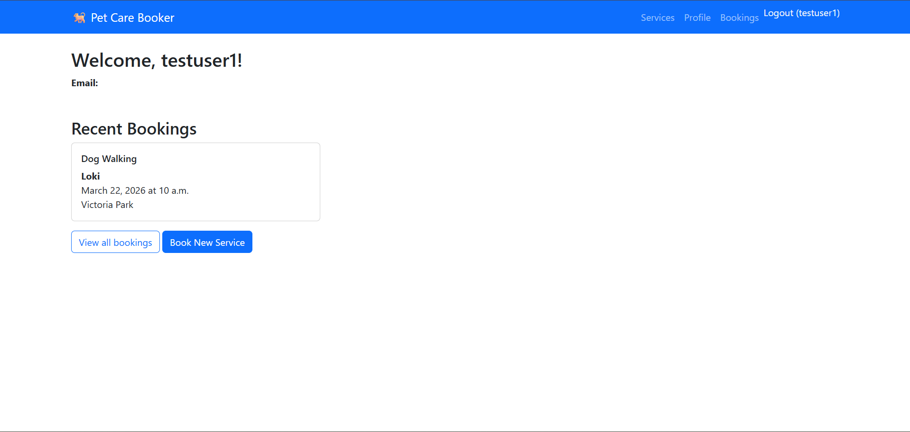](https://pet-care-booker-62152b813817.herokuapp.com/profile/)
[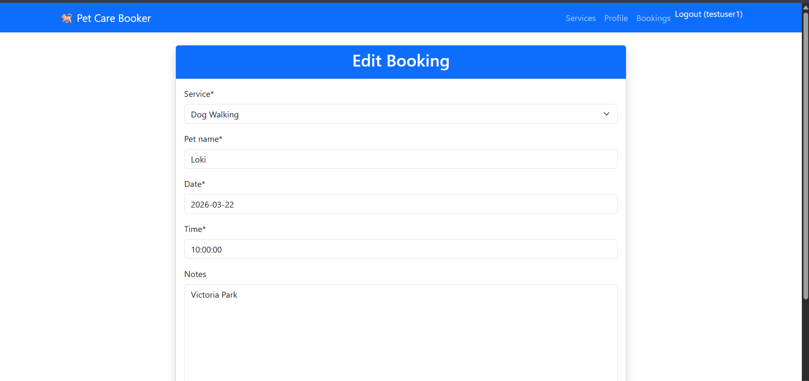](https://pet-care-booker-62152b813817.herokuapp.com/bookings/)
[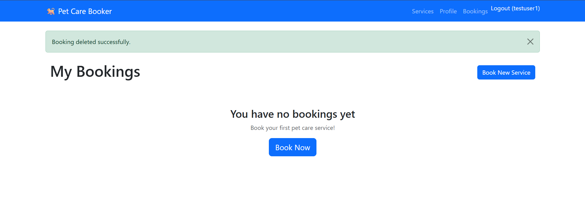](https://pet-care-booker-62152b813817.herokuapp.com/bookings/)

### Mobile Views
[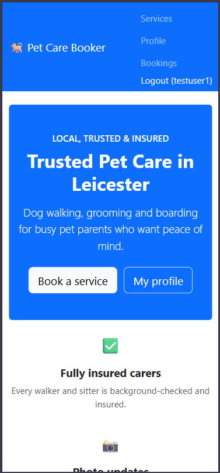](https://pet-care-booker-62152b813817.herokuapp.com/)
[](https://pet-care-booker-62152b813817.herokuapp.com/services/)

### Stripe Webhook Verification
[](https://pet-care-booker-62152b813817.herokuapp.com/bookings/)

## Folder Structure

```text
pet-care-booker/
├── accounts/                # Main functional app containing models, views, forms, templates and URLs
│   ├── migrations/
│   ├── static/
│   ├── templates/
│   ├── tests.py
│   └── admin.py
├── pet_care_booker/         # Project settings and root URL configuration
├── screenshots/             # README screenshots and evidence images
├── Procfile                 # Heroku process types
├── requirements.txt         # Python dependencies
└── README.md
```

## Tech Stack

| Area | Technologies |
|------|--------------|
| Frontend | HTML5, Bootstrap 5, Crispy Forms, JavaScript, jQuery |
| Backend | Django 5.0, Python 3.12, Gunicorn |
| Database | SQLite in development, PostgreSQL in production |
| Deployment | Heroku, Whitenoise |
| Payments | Stripe Checkout, Stripe Webhooks |

## Environment Variables

Create a `.env` file locally and set matching config vars in Heroku:

```text
DEBUG=False
SECRET_KEY=your-secret-key
DATABASE_URL=your-database-url
STRIPE_PUBLISHABLE_KEY=pk_test_...
STRIPE_SECRET_KEY=sk_test_...
STRIPE_WEBHOOK_SECRET=whsec_...
```

## Deployment

### Heroku deployment steps

1. Create the Heroku app.
2. Add the Heroku Postgres add-on.
3. Set all required config vars, including Stripe publishable, secret, and webhook secret keys. [file:1059]
4. Push the project to Heroku.
5. Run migrations on the production database.
6. Confirm static files load correctly and the deployed app opens successfully. [file:973]
7. Register the Stripe webhook endpoint in the Stripe Dashboard using the deployed Heroku URL and confirm successful event delivery. [file:1059]

### Stripe webhook setup

The deployed webhook URL used for production testing is:

```text
https://pet-care-booker-62152b813817.herokuapp.com/stripe/webhook/
```

After creating the webhook endpoint in Stripe Dashboard, the signing secret must be added to Heroku as `STRIPE_WEBHOOK_SECRET`. Stripe event deliveries to this endpoint were verified successfully during testing with HTTP 200 responses. [file:1059]

## Local Setup

```bash
git clone <repo-url>
cd pet-care-booker
python -m venv venv
# Windows
venv\Scripts\activate
# macOS/Linux
source venv/bin/activate

pip install -r requirements.txt
python manage.py makemigrations
python manage.py migrate
python manage.py createsuperuser
python manage.py runserver
```

## Testing

### Manual testing completed

| Feature | Test performed | Outcome |
|--------|----------------|---------|
| Public pages | Opened home page and services page on deployed app | Passed [file:973] |
| Authentication | Logged in and accessed protected pages | Passed [file:973] |
| Booking creation | Submitted booking form and confirmed booking record creation | Passed [file:973] |
| Booking update | Edited an existing booking from the bookings page | Passed [file:973] |
| Booking deletion | Deleted an existing booking through confirmation flow | Passed [file:973] |
| Stripe Checkout | Created checkout session and completed payment through Stripe | Passed [file:973] |
| Webhook delivery | Stripe delivered `checkout.session.completed` and `payment_intent.succeeded` to deployed Heroku webhook endpoint | Passed [file:1059] |
| Paid booking update | Booking status updated to **Paid** after webhook confirmation | Passed [file:1060] |
| Responsive layout | Verified mobile layouts through screenshots and responsive checks | Passed [file:1071] |

### Automated testing

The command below is used for the project test suite:

```bash
python manage.py test
```

### Cross-browser and device testing

- Chrome
- Firefox
- Edge
- Safari
- Chrome DevTools mobile emulation for responsive layout checks [file:1071]

## Known Limitations

- The project would benefit from a broader automated test suite for authentication, payment state handling, and booking ownership checks. [file:897]
- The current implementation is strongest in the booking and payment flow and could be extended further by modelling services as database records rather than fixed choices. [file:897]
- Further refactoring into more fully developed reusable Django apps would strengthen the overall project structure. [file:897]

## Acknowledgements

- My family, for their support and patience throughout the development process. [file:1071]
- Code Institute mentors and learning resources, for guidance during the project. [file:1071]
- The CI learner community, for discussion and shared troubleshooting. [file:1071]

## Attributions

- Bootstrap 5: [https://getbootstrap.com](https://getbootstrap.com) [file:1071]
- Stripe documentation: [https://stripe.com/docs/payments/checkout](https://stripe.com/docs/payments/checkout) [file:1071]
- Heroku Dev Center: [https://devcenter.heroku.com](https://devcenter.heroku.com) [file:1071]
- Django documentation: [https://docs.djangoproject.com](https://docs.djangoproject.com) [file:1071]
- Django Crispy Forms: [https://django-crispy-forms.readthedocs.io](https://django-crispy-forms.readthedocs.io) [file:1071]
- Perplexity AI, for debugging support during Heroku deployment, Stripe integration, and production configuration. [file:1071]
